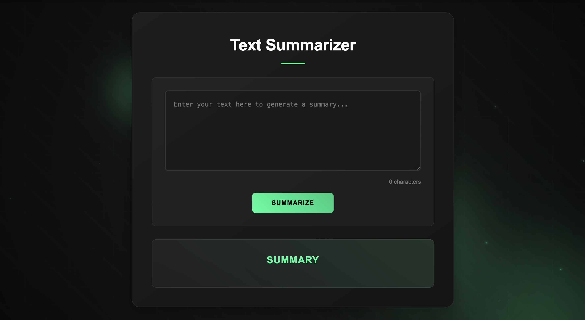

# Text Summarizer 📝✨

A simple yet stylish text summarization app built using **Flask**, **NLTK**, and a futuristic animated UI.

---

## 🚀 Features

- Summarizes large blocks of text in seconds  
- Beautiful animated background and glowing UI  
- Real-time character counter and auto-resize text area  
- Smooth loading animations and ripple effects  
- Future upgrade planned: integration with Hugging Face Transformers

---

## 🛠️ Technologies

Python 3, Flask, NLTK, HTML, CSS, JavaScript

---

## 📦 How to Run This Project

Follow these steps to set it up and view it locally:

1. **Clone this repository**
    ```bash
    git clone https://github.com/akshithsaravanan/text-summarizer.git
    cd text-summarizer
    ```

2. **Create a virtual environment**
    ```bash
    python3 -m venv venv
    source venv/bin/activate  # Mac/Linux
    venv\Scripts\activate     # Windows
    ```

3. **Install dependencies**
    ```bash
    pip install -r requirements.txt
    ```

4. **Run the Flask app**
    ```bash
    python3 app.py
    ```

5. **Visit in your browser**
    Open this link:
    ```bash
    http://127.0.0.1:5000
    ```

---

## 💥 How It Works

- Open the link above in your browser  
- Paste or type text into the box  
- Click **Summarize**  
- View the generated summary below with beautiful animations

---

## 📈 Roadmap

- Basic NLTK summarizer  
- Add Hugging Face Transformers  
- Deploy on Render / Railway / Fly.io  
- Add unit tests

---

## 🙌 Author

Built by [Akshith Saravanan](https://github.com/akshithsaravanan)

---

## 📸 Demo Screenshot

 
